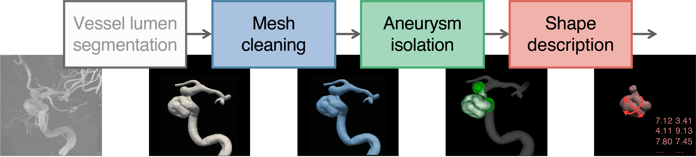
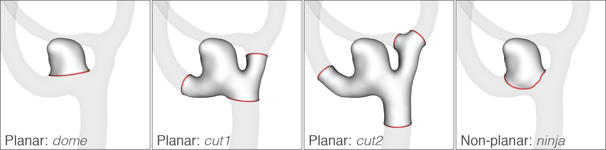
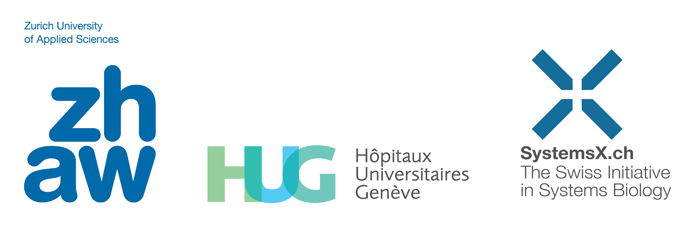

<figure class="image">
  
</figure>

# AneuX morphology database

An open-access, multi-centric database containing 3D geometric models of 750 intracranial aneurysms curated in the context of the AneuX project (2015-2020). The database combines data from three different projects (**AneuX**, **@neurIST** and **Aneurisk**) standardized using a single processing pipeline. 

The aneuxdb repository offers code to process, manipulate and view the 3D geometries for their morphological analysis.

<br>

```
NOTE: Code publication in progress
      Please be patient :)
```

<br>

## At a glance


### Dataset summary:

* 750 aneurysm domes (surface meshes)
* 668 vessel trees (surface meshes)
* 3 different data sources (AneuX, @neurIST, Aneurisk)
* 3 different mesh resolutions (original resolution, 0.01mm² and 0.05mm² target cell area)
* 4 different cut configurations (including planar and free-form cuts)
* 5 clinical parameters (aneurysm rupture status, location and side; patient age and sex)
* 170 pre-computed morphometric indices for each of the aneurysm domes

### Software summary:

* GMTK: A geometric modeling toolkit to compute morphometric parameters, and more
* Scripts implementing the processing pipeline
* File viewer system (intuitive, lightweight, extensible, distributable)
* Code based mostly on Python, [VTK](https://vtk.org/) and [VMTK](http://www.vmtk.org/)


 
## About

* **Authors**: Norman Juchler¹, Philippe Bijlenga², Sven Hirsch¹  
* **Affiliations**:  
¹ [Center of Computational Health](https://www.zhaw.ch/en/lsfm/institutes-centres/icls/computational-health/), Zurich University of Applied Sciences, Switzerland  
² [Neurosurgery Division](https://www.hug.ch/en/neurosurgery), Geneva University Hospital and Faculty of Medicine, Switzerland
* **Licenses**: [CC BY 4.0](https://creativecommons.org/licenses/by/4.0/) (dataset), [MIT](https://github.com/hirsch-lab/aneuxdb/blob/main/LICENSE) (code)
* **Article citation**: Juchler, Schilling, Bijlenga, Kurtcuoglu, Hirsch. *"Shape trumps size: Image-based morphological analysis reveals that the 3D shape discriminates intracranial aneurysm disease status better than aneurysm size"*, Frontiers in Neurology (2022), [DOI: 10.3389/fneur.2022.809391](https://doi.org/10.3389/fneur.2022.809391).  
* **Dataset citation**: Juchler, Bijlenga, Hirsch, *"AneuX morphology database"*, Zenodo, [DOI: 10.5281/zenodo.6678442](https://doi.org/10.5281/zenodo.6678442)


## Dataset

The AneuX morphology database includes data from 3 different data sources: AneuX, @neurIST and Aneurisk. The AneuX data consists of two portions AneuX1 and AneuX2, which have extracted by two different teams of data curators. 

The datasets differ in the exact case selection, but represent a very similar patient cohort (patients examined or treated for ruptured or unruptured aneurysms at the 

The dataset consists of totally 750 aneurysm domes. The geometries were all extracted from 3D rotational angiographies using different vessel lumen segmentation techniques. 

<br>

|     | AneuX1 | AneuX2 | @neurIST | Aneurisk | *Overall* |
|:--- |:---- |:---- |:-------- |:-------- |:------- |
| Number of patients | 247 | 110 |151 |97  |  ***605***
| Sex | F: 197 (77%)<br>M: 57 (33%) | F: 81 (74%)<br>M: 29 (26%) | F: 109 (67%)<br>M: 42 (33%) | F: 61 (63%)<br>M: 36 (37%)  |  ***F: 445 (73%)<br> M: 164 (27%)***
| Patient age in years<br>(mean±SD) | F: 56.4±14.0<br>M: 54.3±13.8 | F: 54.4±12.7<br>M: 50.6±12.2 | F: 53.4±12.2<br>M: 49.8±10.6 | F: 53.6±15.2<br>M: 55.5±10.8  |  ***F: 55.0±13.6<br>M: 52.8±12.2***
| Number of IAs | 350 | 135 | 164 | 101  |  ***750***
Ruptured / unruptured | R: 87 (25%)<br>U: 263 (75%) | R: 41 (30%)<br>U: 79 (59%) | R: 89 (54%)<br>U: 75 (46%) | R: 44 (44%)<br>U: 57 (56%)  |  ***R: 261 (35%)<br>U: 474 (65%)***

**Table 1**: Summary of the different sub-datasets.

<br>

## Processing

The processing consists of the following main steps (Figure 1): mesh cleaning (re-meshing and smoothing), aneurysm isolation (cutting) and shape description (morphometry). The extraction of the vessel geometries (vessel lumen segmentation) is not further explained here, as the AneuX morphology database does not contain medical imaging data.

<br>

<!--
Option 1: Image with caption - Markdown only

**Figure 1**: Mesh processing pipeline
-->

<!--
Option 2: Image with caption - HTML only
-->
<figure class="image">
  
  <figcaption><b>Figure 1</b>: Mesh processing pipeline</figcaption>
</figure>
 
<!--
Option 3: Image with caption - Markdown and HTML mixed


**Figure 1**: Image processing pipeline
-->

<br><br>

**Mesh cleaning:** Many operations on surface meshes are highly sensitive to mesh defects, such as small holes, singular/non-manifold edges or vertices, incoherently oriented mesh cells, isolated or intersecting elements [1]. Re-meshing the input surfaces with an appropriate target cell area can solve many of these problems. Smoothing equally has a sanitizing, homogenizing effect on the surface meshes, see Figure 2.

Therefore, it is recommended to clean the input surface meshes. The processing scripts rely on VMTK's surface re-meshing tool ([link](http://www.vmtk.org/vmtkscripts/vmtksurfaceremeshing.html)), with target cell area of 0.05mm² or 0.01mm². For smoothing, non-shrinking Taubin smoothing is used, implemented in VTK ([link](https://vtk.org/doc/nightly/html/classvtkWindowedSincPolyDataFilter.html)). Note that Taubin's method is a "topological" smoother that disregards spatial proximity. Consequently, smoothing meshes with different resolutions and fixed smoothing parameters will produce different results. In order to achieve similar spatial smoothing for differently resolved surface meshes, the parameters were adjusted based on a heuristic relationship.

<br>

<figure class="image">
  
  <figcaption><b>Figure 2</b>: Comparison of different mesh resolutions</figcaption>
</figure>

<br><br>


**Aneurysm isolation:** GMTK offers two cut tools to isolate the aneurysm, implemented as extensions for the GMTK FileViewer. With the *planar* method (extension: `ex:cut`), the aneurysm domes are delineated using planar cuts. The placement of cut planes is facilitated using the centerlines of the parent vessels. With the *ninja* method (extension: `ex:scissor`), the aneurysm domes are isolated using non-planar, free-form cuts. 

Both methods require manual input by an operator. It is recommended to clean the surface meshes of the isolated aneurysm domes once more after cutting (re-meshing, no smoothing) to remove seams or other artifacts caused by the cutting routines.

Figure 3 illustrates all cut configurations relevant for the Aneux morphology database. The cut planes / seams were determined according to a set of predetermined rules. ([Link](https://doi.org/10.3389/fneur.2022.809391))

<br>

<figure class="image">
  
  <figcaption><b>Figure 3</b>: Different cut configurations</figcaption>
</figure>

<br><br>

**Geometry description:** A brief description of the morphometric features computed for the AneuX morphology database is included in [Juchler 2022](https://doi.org/10.3389/fneur.2022.809391). Note that some methods are more sensitive to mesh resolution or different cutting methods than others.

**Implementation:** The scripts under `code/aneuxdb/processing/` implement the above steps. Table 1 provides a summary of what these scripts do. Some of scripts require user interaction (*manual* mode), others of which do not (*automated* mode). 

*Note*: The provided scripts make use of the GMTK library, see ../gmtk/README.md **TODO** for the setup instructions.


*Note*: The steps are not chained, that is, the output of one script is not necessarily the input of the next script. To update the AneuX morphology database with updated items, copy the result folders manually to `$ANEUX_DATA` or one of its subdirectories.

<br>

| Step | Description | Mode | Input | Output |
|:----|:----------- |:---- |:------|:-------|
| 1. | Mesh cleaning of vessel models | Automated | Vessels | Vessels*
| 2. | Extract centerlines | Manual | Vessels* | Centerlines |
| 3. | Run cut-tools| Manual | Vessels*, centerlines | Cut specs |
| 4. | Apply the cuts | Automated | Vessels*, cut specs | Aneurysms |
| 5. | Mesh cleaning of aneurysms | Automated | Aneurysms | Aneurysms* |
| 6. | Show/inspect the data | Manual | Aneurysms*, vessels | – |
| 7. | Compute geometry indices | Automated | Aneurysms* | Morpho data

**Table 2**: Sequence of operations to compute morphometric indices. The * indicates geometries after mesh cleaning.

<br><br>


## Acknowledgments

We thank the following people for their support and contributions to the AneuX project, namely (in alphabetical order)


* Diana Sapina
* Karl Lovblad
* Karl Schaller
* Olivier Brina
* Paolo Machi
* Rafik Ouared
* Sabine Schilling
* Sandrine Morel
* Ueli Ebnöther
* Vartan Kurtucuoglu
* Vitor Mendes Pereira
* Zolt Kuscàr


The AneuX project was supported by SystemsX.ch, and evaluated by the Swiss National Science Foundation (SNSF). This database would not be possible without the support of the Zurich University of Applied Sciences (ZHAW) and University Hospitals Geneva (HUG)

<br>



<br>

## References

\[1\]: Campen et al., 2012, A practical Guide to Polygon Mesh Repairing. [Link](https://www.graphics.rwth-aachen.de/publication/034/)

**[TODO]**: Refs vmtk, vtk, own publications.
